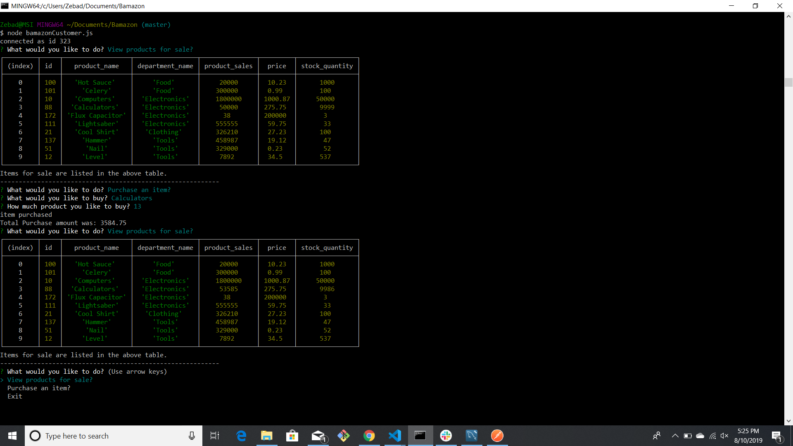
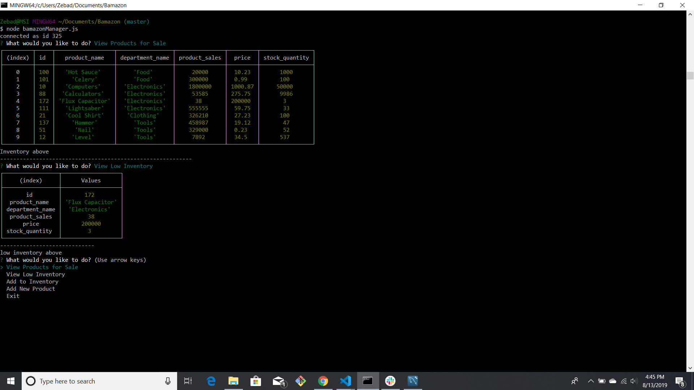
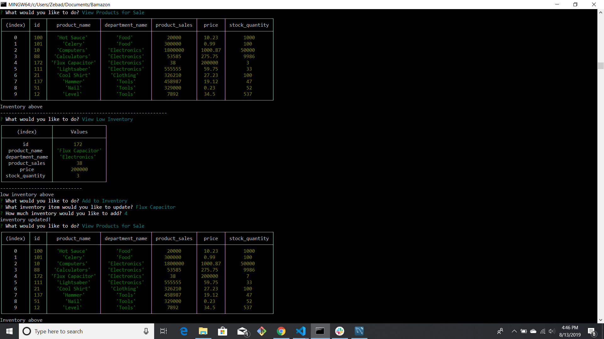
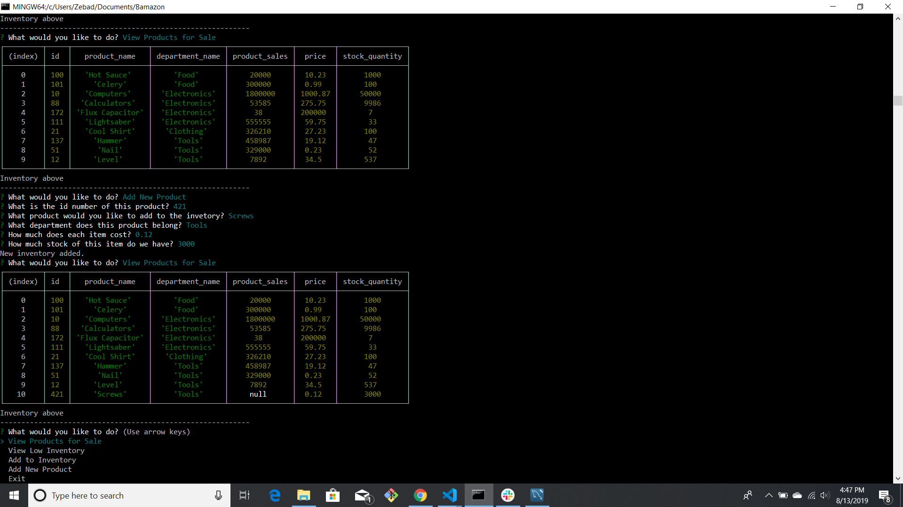
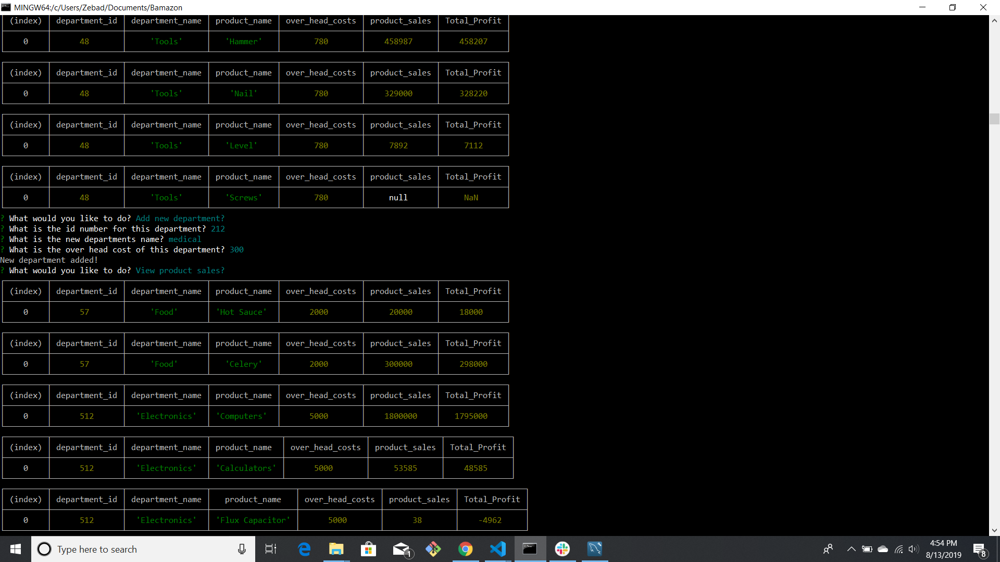
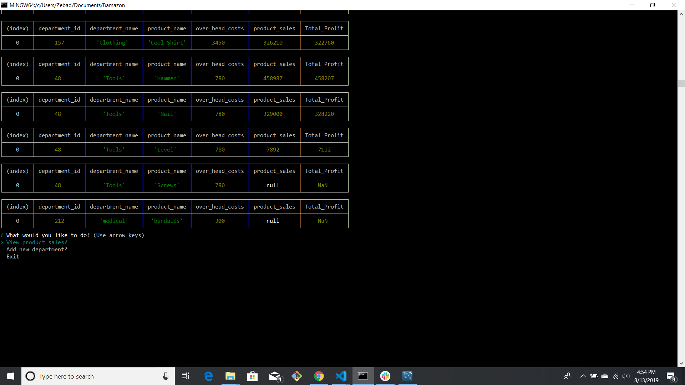

# Bamazon

Welcome to Bamazon!
With this program you are able to purchase items from a database as a customer, check and manage product inventory as a manager, and handle deparment and profit margins as a supervisor!

Bamazon uses the following programing applications to run.

+ Node.js
+ Javascript
+ Inquirer
+ MySQL

## Bamazon Customer
-------
With Bamazon customer you are able to view products for sale and purchase the available items.
In order to access the products for sale and purchase products enter the command  line *node bamazonCustomer.js*.

This will then prompt the user to make a selection and based on that selection they will be able to

+ View products for sale
+ Purchase an item
+ Exit

------
## Bamazon Manager
-------
With Bamazon manager the user is able to manage product inventory.
In order to access the information enter the command  line *node bamazonManager.js*.

This will then prompt the user to make a selection and based on that selection they will be able to

* View products for sale.
* View low inventory.
* Add to  inventory.
* Add new product.
* Exit.

------
## Bamazon Supervisor
-------
With Bamazon supervisor the unit is able to manage all departments and view profits.
In order to access the information enter the command  line *node bamazonSupervisor.js*.

This will then prompt the user to make a selection and based on that selection they will be able to

* View product sales.
* Add ne department.
* Exit.

